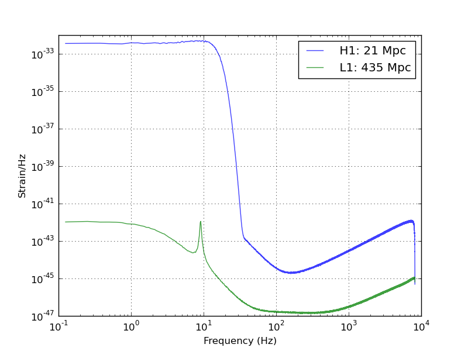

\page fakedataoverviewpage

[TOC]

\section Introduction Introduction

gstlal provides several tools for producing fake gravitational wave data for
the purpose of simulating various scenarios.  This page works through several
examples starting with simple command line data generation, working up to
Condor DAGs that can generate months of fake data suitable for MDC studies.

\section DetNoise Basic LIGO/ALIGO colored Gaussian noise on the command line

Consult gstlal_fake_frames for more details

Here is an example to generate fake initial LIGO data on the command line

	$ gstlal_fake_frames --data-source=LIGO --channel-name=H1=FAKE-STRAIN --frame-type=H1_FAKE --gps-start-time=900000000 --gps-end-time=900005000 --output-path=testframes  --verbose

Note the contents of the frame directory: 

	$ ls testframes/H-FAKE-900/
	H-FAKE-900000000-1792.gwf  H-FAKE-900001792-3208.gwf

Similarly, one can generate advanced LIGO data

	$ gstlal_fake_frames --data-source=AdvLIGO --channel-name=L1=FAKE-STRAIN --frame-type=L1_FAKE --gps-start-time=900000000 --gps-end-time=900005000 --output-path=testframes  --verbose

To verify that this dat makes sense we can try to measure the psd using gstlal_reference_psd

First we need a frame cache

	$ ls testframes/*/* | lalapps_path2cache > frame.cache

Then we can measure the PSDs of the data like this:

	$ gstlal_reference_psd --data-source frames --frame-cache frame.cache --gps-start-time=900000000 --gps-end-time=900005000 --channel-name=H1=FAKE-STRAIN --channel-name=L1=FAKE-STRAIN --write-psd psd.xml.gz --verbose

We can see how we did by plotting the resulting psd

	$ gstlal_plot_psd psd.png psd.xml.gz 

\section CustomNoise Custom colored noise, i.e. simulate your own detector

Obviously it is not practical to code up every possible noise curve to simulate as a custom data source.  However, it is possible to provide your own custom noise curve as an ASCII file with frequency in one column and strain/Hz in the second.

Take for example the early virgo noise curve <a href=http://www.lsc-group.phys.uwm.edu/cgit/gstlal/plain/gstlal/share/v1_early_asd.txt>here</a>.

	$ wget http://www.lsc-group.phys.uwm.edu/cgit/gstlal/plain/gstlal/share/v1_early_asd.txt

First convert it to an xml file appropriate for reading with gstlal

	$ gstlal_psd_xml_from_asd_txt --instrument=V1 --output v1psd.xml.gz v1_early_asd.txt

Then we can color the data like this:

	$ gstlal_fake_frames --data-source=white --color-psd v1psd.xml.gz --channel-name=V1=FAKE-STRAIN --frame-type=V1_FAKE --gps-start-time=900000000 --gps-end-time=900005000 --output-path=testframes  --verbose

And repeat a similar validation process as above

	$ ls testframes/*/* | lalapps_path2cache > frame.cache
	$ gstlal_reference_psd --data-source frames --frame-cache frame.cache --gps-start-time=900000000 --gps-end-time=900005000 --channel-name=V1=FAKE-STRAIN --write-psd psd.xml.gz --verbose
	$ gstlal_plot_psd psd.png psd.xml.gz v1psd.xml.gz

\section RecoloredNoise Recolored noise

This procedure is very similar to the above except that instead of using white noise to drive the fake frame generation, we start with real frame data and whiten it.

The first step is to get segments for the data you wish to recolor

	$ ligolw_segment_query --segment-url=https://segdb.ligo.caltech.edu -q --gps-start-time 966384015 --gps-end-time 971568015 --include-segments=H1:DMT-SCIENCE:4  --result-name=datasegments > H1segments.xml

To whittle down the list, we can just look at long lock stretches by trimming the list to only include segments greater than 100,000 seconds.

	$ gstlal_segments_trim --min-length 100000 --output trimsegs.xml.gz H1segments.xml

Next we can print the results, to find suitable start/stop times.

	$ ligolw_print -t segment -c start_time -c end_time trimsegs.xml.gz

Then we can find frames for one of the segments

	$ ligo_data_find -o H -t  H1_LDAS_C02_L2 -l  -s 966947490 -e 967054549 --url-type file > frame.H1.cache

Now that we have a frame cache we can recolor the data using <a href=http://www.lsc-group.phys.uwm.edu/cgit/gstlal/plain/gstlal/share/early_aligo_asd.txt>this spectrum</a>.

	$ wget href=http://www.lsc-group.phys.uwm.edu/cgit/gstlal/plain/gstlal/share/early_aligo_asd.txt
	$ gstlal_psd_xml_from_asd_txt --instrument=H1 --output H1psd.xml.gz early_aligo_asd.txt

First we compute a reference spectrum from that data (using a shorter segment to make the example go faster)

	$ gstlal_reference_psd --data-source frames --frame-cache frame.H1.cache --gps-start-time=966947490 --gps-end-time=966948490 --channel-name=H1=LDAS-STRAIN --write-psd H1refpsd.xml.gz --verbose

For best results remove lines from the reference spectrum

	$ gstlal_psd_polyfit --output smooth.xml.gz H1refpsd.xml.gz

Then we can recolor

	$ gstlal_fake_frames --data-source=frames --frame-cache frame.H1.cache --whiten-reference-psd smooth.xml.gz --color-psd H1psd.xml.gz --channel-name=H1=LDAS-STRAIN --output-channel-name=FAKE-STRAIN --frame-type=H1_FAKE --gps-start-time=966947490 --gps-end-time=966948490 --output-path=recoloredframes  --verbose

And validate:

	$ ls recoloredframes/*/* | lalapps_path2cache > recoloredframe.cache
	$ gstlal_reference_psd --data-source frames --frame-cache recoloredframe.cache --gps-start-time=966947490 --gps-end-time=966948490 --channel-name=H1=FAKE-STRAIN --write-psd H1validatepsd.xml.gz --verbose
	$ gstlal_plot_psd /home/channa/public_html/psd.png H1validatepsd.xml.gz H1psd.xml.gz
	
\section RecoloredNoiseDAG Recoloring existing data with a HTCondor dag

Some of the steps required to automate the batch processing of recoloring a large data set has been automated in a script that generates a condor DAG.  The input to the condor dag script has itself been automated in makefiles such as:  <a href=http://www.lsc-group.phys.uwm.edu/cgit/gstlal/plain/gstlal/share/Makefile.2015recolored>this</a>.

As an example try this:

	$ wget http://www.lsc-group.phys.uwm.edu/cgit/gstlal/plain/gstlal/share/Makefile.2015recolored
	$ make -f Makefile.2015recolored
	$ condor_submit_dag gstlal_fake_frames_pipe.dag

You can monitor the dag progress with

	$ tail -f gstlal_fake_frames_pipe.dag.dagman.out

You should have directories called LIGO and Virgo that contain the recolored frame data.  Try changing values in the Makefile to match what you need

\section Signals Simulating signals on the command line

Assuming you have an XML file containing inspiral injections called injections.xml, you can generate injection time series in the following way

	$ gstlal_fake_frames --data-source silence --output-path V1_INJECTIONS --gps-start-time 966384031 --frame-type V1_INJECTIONS --gps-end-time 966389031 --frame-duration 16 --frames-per-file 256 --verbose --channel-name=V1=INJECTIONS --injections injections.xml

\section TODO

 -# Add support for making colored noise in the gstlal_fake_frames_pipe
