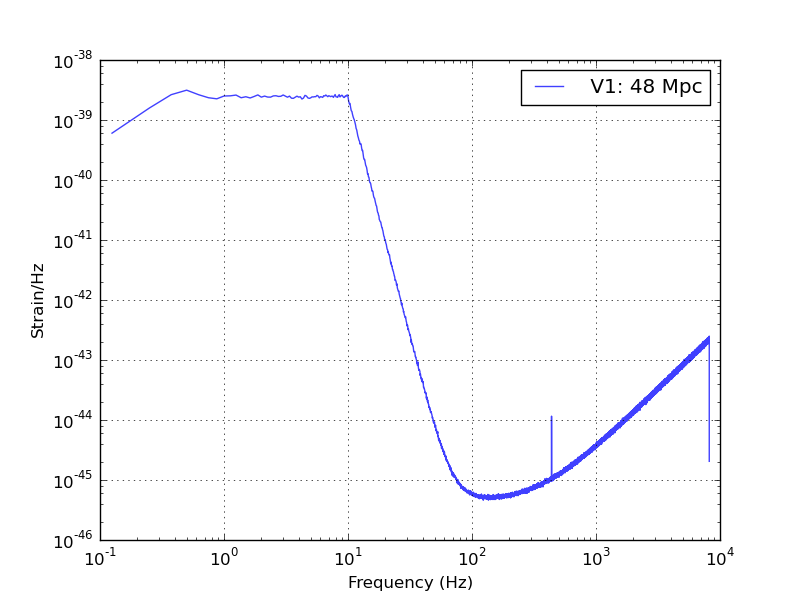

\page gstlalfakedataoverviewpage Documentation for creating fake data

[TOC]

\section Introduction Introduction

gstlal provides several tools for producing fake gravitational wave data for
the purpose of simulating various scenarios.  This page works through several
examples starting with simple command line data generation, working up to
Condor DAGs that can generate months of fake data suitable for MDC studies.

\section DetNoise Basic LIGO/ALIGO colored Gaussian noise on the command line

Consult gstlal_fake_frames for more details

The basic steps to generate and validate LIGO colored noise are:

-# use gstlal_fake_frames to make the data (examples in the documenation include this)
-# verify that the PSD is as you would expect with gstlal_reference_psd (examples in the documentation include this)
-# plot the resulting PSD with gstlal_plot_psd (examples in the documentation include this)

An example PSD plot:

\section CustomNoise Custom colored noise, i.e. simulate your own detector

Consult gstlal_fake_frames for more details

-# Start by obtaining a reference PSD that you wish to have as the target for
recoloring. If you actually have a text file ASD such as this one: e.g. <a
href=http://www.lsc-group.phys.uwm.edu/cgit/gstlal/plain/gstlal/share/v1_early_asd.txt>here</a>,
then you will need to first use gstlal_psd_xml_from_asd_txt to convert it
(examples in the documentation include this)
-# Next use gstlal_fake_frames to make the data with the desired PSD (examples
in the documentation include this)
-# Repeat the same validation steps as above to obtain, e.g.:
 

\section RecoloredNoise Recolored noise

Consult gstlal_fake_frames for more details

This procedure assumes you are on an LDG cluster which has the data you wish to
recolor.  Note that some of the tools required on not gstlal based.  Please
consult the documentation for the external tools should you have questions.

-# First obtain segments for the data using ligolw_segment_query
-# Next obtain the frame file cache from ligo_data_find
-# Then create the PSD you wish to recolor to (perhaps using gstlal_psd_xml_from_asd_txt)
-# compute a reference spectrum from the frame data that you wish to recolor using gstlal_reference_psd
-# You might choose to optionally "smooth" the reference spectrum in order to leave lines in the underlying data.  You can try using gstlal_psd_polyfit
-# Now with segments, a frame cache, a PSD (possibly smoothed) measured from the frame cache, and a PSD that is the target for the recolored spectrum, you are free to use gstlal_fake_frames according to the documentation.

\section RecoloredNoiseDAG Recoloring existing data with a HTCondor dag

Some of the steps required to automate the batch processing of recoloring a
large data set has been automated in a script that generates a condor DAG.  The
input to the condor dag script has itself been automated in makefiles such as:
<a
href=http://www.lsc-group.phys.uwm.edu/cgit/gstlal/plain/gstlal/share/Makefile.2015recolored>this</a>.

As an example try this:

	$ wget http://www.lsc-group.phys.uwm.edu/cgit/gstlal/plain/gstlal/share/Makefile.2015recolored
	$ make -f Makefile.2015recolored
	$ condor_submit_dag gstlal_fake_frames_pipe.dag

You can monitor the dag progress with

	$ tail -f gstlal_fake_frames_pipe.dag.dagman.out

You should have directories called LIGO and Virgo that contain the recolored frame data.  Try changing values in the Makefile to match what you need

\section TODO

 -# Add support for making colored noise in the gstlal_fake_frames_pipe
